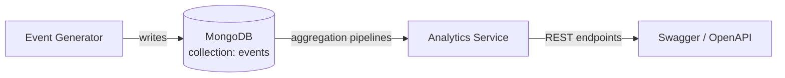

<div align="center">

# Boîte Noire

**High-volume event ingestion and analytics engine** — Spring Boot · MongoDB

[](https://openjdk.org/projects/jdk/21/)
[](https://spring.io/projects/spring-boot)
[](https://www.mongodb.com/)
[](https://maven.apache.org/)

[Repository](https://github.com/mahira-manico/BoiteNoire)

</div>

---

## 1. Overview

Boîte Noire implements a collection and analysis system for heterogeneous application event logs — connections, subscription payments, application errors, public API calls, and notification deliveries.

All statistics are computed through **MongoDB aggregation pipelines** executed directly by the database engine, rather than loaded into memory and processed in Java. On a dataset of 100,000+ simulated events, this distinction is what keeps the analytics fast.



---

## 2. Prerequisites

| Tool | Version |
|---|---|
| Java JDK | 21 |
| MongoDB | running locally or reachable instance |
| Maven | latest stable |

---

## 3. Configuration

By default, the application connects to a local MongoDB instance:

| Setting | Value |
|---|---|
| URI | `mongodb://localhost:27017` |
| Database | `boitenoire` |
| Collection | `events` |

These can be changed in `src/main/resources/application.properties`:

```properties
spring.data.mongodb.uri=mongodb://localhost:27017/boitenoire
```

---

## 4. Build & Run

```bash
git clone https://github.com/mahira-manico/BoiteNoire.git
cd BoiteNoire
mvn clean install
mvn spring-boot:run
```

The API is then available at `http://localhost:8080`, with interactive documentation on Swagger UI at [`http://localhost:8080/swagger-ui/index.html`](http://localhost:8080/swagger-ui/index.html).

---

## 5. Data Generator

A dedicated Java generator populates the `events` collection with realistic data before any analysis is run:

- at least **100,000 events**, spread across a **simulated year**
- **non-uniform volume**: daytime peaks, nighttime troughs, busier days than others
- a **coherent user population**: a handful of heavy users, many light ones
- at least **five distinct event structures**, with a mix of **embedding** and **referencing**, and a set of common fields enabling cross-event queries

On Windows, run it with:

```bat
.\mvnw.cmd spring-boot:run "-Dspring-boot.run.arguments=--generate-events"
```

---

## 6. Analytics Endpoints

Each analysis is exposed as a documented read endpoint, backed entirely by a MongoDB aggregation pipeline:

1. **Top active users** — the 10 most active users over a given period.
2. **Error breakdown** — error counts by type and by day, over a given period.
3. **Response time by endpoint** — average and 95th percentile.
4. **Conversion funnel** — how many users completed a given event sequence (e.g. signup → first message → subscription).

---

## 7. Performance Optimization

The most expensive query among the four analyses was profiled and optimized. `docs/` contains, for that query:

- the `explain()` output **before** indexing (documents examined, documents returned, time)
- the index created, with the reasoning behind field choice and order
- the `explain()` output **after** indexing
- a short written conclusion

---

## 8. Project Structure

```
BoiteNoire/
├── src/          Spring Boot service and data generator
├── docs/         Decision note (ADR), document model, performance report
└── README.md
```

---

## 9. Documentation

Supporting documents live in `docs/`:

- Architecture decision note — relational vs. document modeling for this use case
- Document model, with embedding/referencing choices justified
- Performance report (explain before/after, index justification)

---

## 10. Deliverables Checklist

| # | Deliverable | Location                                      | Status |
|---|---|-----------------------------------------------|---|
| 1 | Decision note (ADR), relational vs. documentary | `docs/ADR.md`                    | Done |
| 2 | Document model schema | `docs/schema.md`)           | Done |
| 3 | Event generator ( 100,000 docs) | `src/main/java/runner/EventGeneratorRunner.java` | Done |
| 4 | Analytics components (aggregation pipelines) | `src/main/java/service/AnalyticsService.java` | Done |
| 5 | Optimization report & explain | `docs/performance.md`                         | Done |
| 6 | README with run instructions | `README.md`                                   | Done |

---

## Contributors

<table>
  <tr>
    <td align="center" width="140">
      <a href="https://github.com/mahira-manico">
        <br/>
        <sub>mahira-manico</sub>
      </a>
    </td>
    <td align="center" width="140">
      <a href="https://github.com/moinahalima-abdou">
        <br/>
        <sub>moinahalima-abdou</sub>
      </a>
    </td>
  </tr>
</table>
